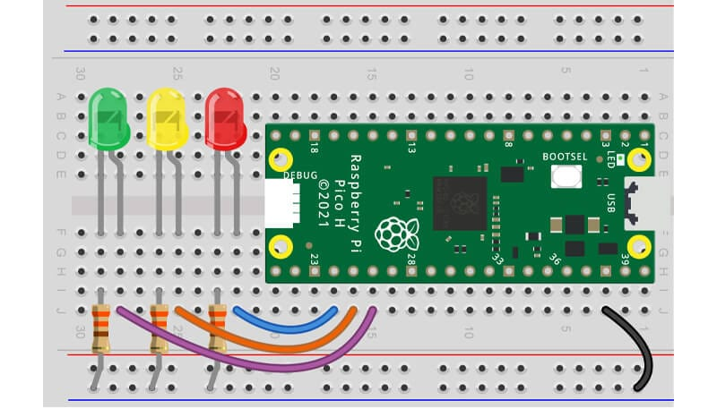

# Pi Hut Maker Advent Calendar - VSCode Edition

A VSCode-based adaptation of the
[Pi Hut Maker Advent Calendar 2022](https://thepihut.com/pages/maker-advent-2022-guides)
tutorials, reworked to use **VSCode + MicroPico** instead of Thonny.

Built to teach my nephew how to program a **Raspberry Pi Pico H** with basic
electronics - no Thonny required.

## Hardware

- Raspberry Pi Pico H
- Pi Hut Maker Advent Calendar 2022 kit components (LEDs, resistors, jumper
  wires, breadboard, etc.)

## Prerequisites

- [VSCode](https://code.visualstudio.com/)
- [MicroPico VSCode extension](https://marketplace.visualstudio.com/items?itemName=paulober.pico-w-go)
- MicroPython firmware flashed to the Pico (see Day 1 guide)

## Days

| Day | Topic | Guide | Scripts |
|-----|-------|-------|---------|
| 1 | VSCode + MicroPython setup | [Day 1](docs/pihut-advent-calendar-day1-vscode-setup.md) | `hello.py`, `led.py` |
| 2 | LEDs, resistors, breadboard wiring | [Day 2](docs/pihut-advent-calendar-day2-vscode-blinky.md) | `blinky.py`, `flash.py`, `chase.py` |

## Running Code

With the Pico connected via USB and **Pico Connected** showing in the VSCode
status bar:

- **Run on Pico:** Click the `▶ Run` button in the status bar, or
  `Ctrl+Shift+P` > **MicroPico: Run current file on Pico**
- **Stop execution:** Click the Stop button, or
  `Ctrl+Shift+P` > **MicroPico: Stop execution**

## James' Progress

### Part 1 - VSCode + MicroPython Setup


- Flashed MicroPython firmware onto the Pico H
- Installed VSCode and the MicroPico extension
- Connected to the Pico from VSCode and ran [`hello.py`](hello.py) and
  [`led.py`](led.py) — turning on the built-in LED on the Pico, then figuring
  out what code to change to switch it on and off: 
  
  ```python
  onboardLED.value(0) # built-in LED OFF
  onboardLED.value(1) # built-in LED ON
  ```

### Part 2 - Let's Get Blinky



- Built the circuit: three LEDs with current-limiting resistors wired to GPIO
  pins 18, 19, and 20
- Ran [`blinky.py`](blinky.py) to light all three LEDs at once
- James worked to identify which GPIO pin controlled which LED colour by commenting out two
  of the three LED lines, running the script to light a single LED, noting its
  colour, then repeating for each — correctly naming each variable by its
  colour in the code
- Ran [`flash.py`](flash.py) to flash all LEDs on and off 10 times using a
  `while` loop
- Ran [`chase.py`](chase.py) to sequence the LEDs one at a time in a
  red → amber → green chase effect. The code sample left the green LED on at the end of the sequence.
  >James and I worked together to figure out how to ensure the green LED was switched off at the end of the loop, we added the following code at the end of the program to switch off the green LED

  ```python
  green.value(0)  # Turn off green after loop ends
  ```

## Credits

Original tutorials by [The Pi Hut](https://thepihut.com/pages/maker-advent-2022-guides).
This repo adapts those guides for VSCode + MicroPico workflow.
