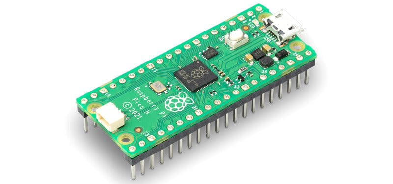
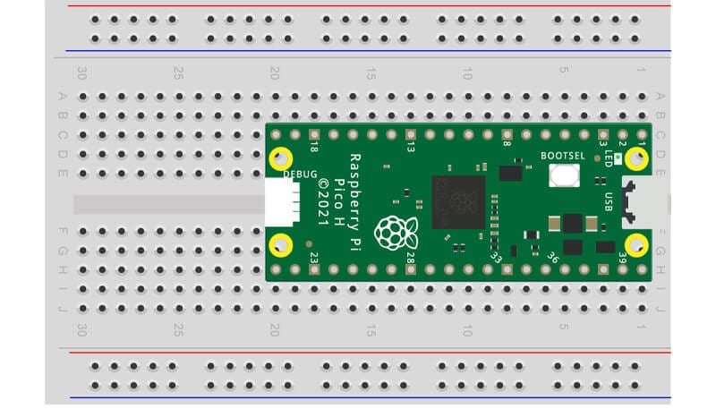
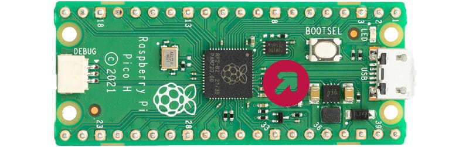

# Pi Hut Maker Advent Calendar - Day 1: Getting Started (VSCode Edition)

> **Original tutorial:** [Pi Hut - Maker Advent Calendar Day 1](https://thepihut.com/blogs/raspberry-pi-tutorials/maker-advent-calendar-day-1-getting-started)
>
> This guide replaces Thonny with **VSCode + MicroPico** for a much better
> development experience (dark theme, autocomplete, proper editor, extensions, etc.)

---

## What's in the Box (Day 1)


- **Raspberry Pi Pico H** (with pre-soldered headers)
- 1m Micro-USB cable
- 400-point solderless breadboard



---

## Part 1: Install Prerequisites

### 1a. Install VSCode

Download and install from: https://code.visualstudio.com

### 1b. Make Sure Python is on Your System

You need **Python 3.9+** installed and available in your PATH.

Open a terminal and check:

```bash
python --version
```

If you don't have it, download from https://www.python.org/downloads/ and make
sure to tick **"Add Python to PATH"** during installation.

### 1c. Install pyserial

The MicroPico extension needs `pyserial` to talk to the Pico over USB:

```bash
pip install pyserial
```

---

## Part 2: Flash MicroPython Firmware onto the Pico

This step loads the MicroPython interpreter onto your Pico. You only need to do
this once (unless you want to update the firmware later).

### Step-by-step:

1. **Download the MicroPython UF2 firmware** for the Raspberry Pi Pico from:
   https://micropython.org/download/RPI_PICO/

   Grab the latest `.uf2` file (e.g. `RPI_PICO-20251209-v1.27.0.uf2`).

2. **Plug the Pico into the breadboard.** Push it in so you can't see any of
   the metal pins - it should sit firmly.

   

3. **Hold down the BOOTSEL button** on the Pico (the small white button on the
   board) **while** plugging the USB cable into your computer.

   

4. A new drive called **RPI-RP2** will appear (like a USB stick).

5. **Drag and drop** the `.uf2` file onto the RPI-RP2 drive.

6. The drive will disappear automatically - that means the firmware has been
   flashed successfully. The Pico now runs MicroPython.

---

## Part 3: Install the MicroPico Extension in VSCode

1. Open VSCode.
2. Click the **Extensions** icon in the left sidebar (or press `Ctrl+Shift+X`).
3. Search for **"MicroPico"**.
4. Click **Install** on the **MicroPico** extension (by paulober).

> This extension was previously called "Pico-W-Go". It provides:
> - Auto-completion for MicroPython / Pico APIs
> - Built-in REPL terminal to talk to your Pico
> - Run and upload buttons in the status bar
> - File upload/download to the Pico's filesystem

---

## Part 4: Set Up Your Project

1. Create a new folder for your advent calendar work, e.g. `pico-advent`.
2. In VSCode: **File > Open Folder** and select that folder.
3. Press `Ctrl+Shift+P` to open the Command Palette.
4. Type **"MicroPico"** and select **"MicroPico: Configure project"**.
5. You should see a success notification. This creates some config files in
   your project for autocomplete and board communication.

You should now see **Pico Connected** in the VSCode status bar at the bottom.
If it says "Pico Disconnected", make sure:
- The USB cable is plugged in (and is a data cable, not charge-only)
- The firmware was flashed correctly (Part 2)
- You have `pyserial` installed (Part 1c)

---

## Part 5: Activities (Same as the Original Tutorial)

### Activity 1 - Hello from the Pico

Create a new file called `hello.py` with this code:

```python
print("This is my Pico talking")
```

**To run it:**
- Click the **Run** button in the VSCode status bar at the bottom, OR
- Press `Ctrl+Shift+P` > **"MicroPico: Run current file on Pico"**

You should see the output in the **MicroPico REPL** terminal panel:

```
This is my Pico talking
```

> **Tip:** You can also type commands directly into the REPL terminal at the
> bottom - it's an interactive MicroPython prompt, just like the one in Thonny.

### Activity 2 - Blink the Onboard LED


Create a new file called `led.py`:

```python
from machine import Pin

onboardLED = Pin(25, Pin.OUT)
onboardLED.value(1)
```

Run it the same way. The small LED on the Pico should light up!

Change the value to `0` and run again to turn it off:

```python
from machine import Pin

onboardLED = Pin(25, Pin.OUT)
onboardLED.value(0)
```

---

## Quick Reference: Common MicroPico Commands

Open the Command Palette (`Ctrl+Shift+P`) and type "MicroPico" to see all
available commands. The most useful ones:

| Command | What it does |
|---|---|
| **MicroPico: Run current file on Pico** | Runs the file - doesn't save it to the Pico |
| **MicroPico: Upload current file to Pico** | Saves the file permanently to the Pico's filesystem |
| **MicroPico: Upload project to Pico** | Uploads all project files to the Pico |
| **MicroPico: Delete all files from board** | Wipes the Pico's filesystem |
| **MicroPico: Configure project** | Initialises a project with autocomplete stubs |

### Run vs Upload - What's the Difference?

- **Run** = executes the code immediately but doesn't store it on the Pico.
  When you unplug, the code is gone. Good for testing.
- **Upload** = saves the file to the Pico's filesystem. If you upload a file
  called `main.py`, the Pico will **automatically run it on boot** - meaning
  your project works without a computer attached.

---

## Thonny vs VSCode Comparison

| Feature | Thonny | VSCode + MicroPico |
|---|---|---|
| Dark theme | No | Yes |
| Autocomplete | Basic | Full IntelliSense for MicroPython |
| Multiple files | Clunky | Native tabs, file explorer |
| Extensions | None | Thousands available |
| Git integration | None | Built-in |
| Firmware flash | Built-in dialog | Manual drag-and-drop (one-time) |
| REPL | Built-in | Built-in (terminal panel) |
| Run code | Click Run | Click Run / Ctrl+Shift+P |
| Upload to Pico | File > Save as (to Pico) | MicroPico: Upload command |

The only thing Thonny makes slightly easier is the initial firmware flash
(it has a dialog for it). But since you only do that once, the drag-and-drop
method is perfectly fine.

---

## Troubleshooting

### "Pico Disconnected" in the status bar
- Check your USB cable is a **data cable** (some cheap cables are charge-only)
- Make sure MicroPython firmware is installed (Part 2)
- Try unplugging and replugging the Pico
- Run `pip install pyserial` again to make sure it's installed

### The RPI-RP2 drive doesn't appear
- Make sure you're **holding BOOTSEL while plugging in the USB**
- Try a different USB port
- Try a different USB cable

### Code runs but nothing happens with the LED
- Double-check you're using **Pin 25** - that's the onboard LED on the Pico H.

### "No module named 'machine'"
- You're running the code on your computer's Python, not on the Pico. Make sure
  you use **"MicroPico: Run current file on Pico"** and not the regular Python
  run button.
