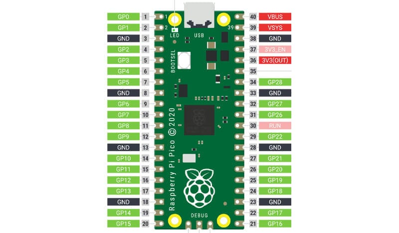
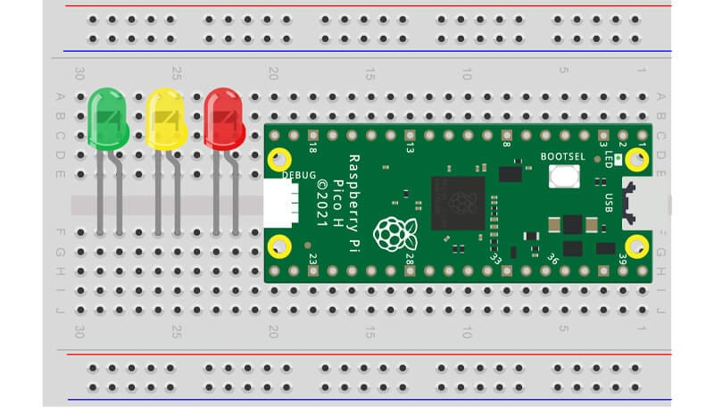
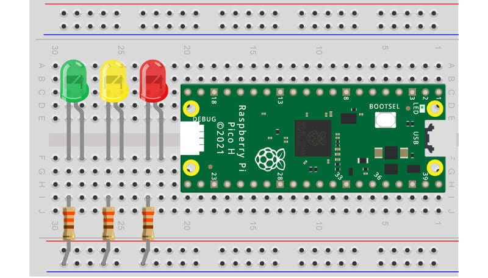
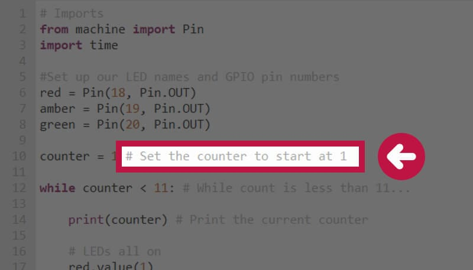

# Pi Hut Maker Advent Calendar - Day 2: Let's Get Blinky (VSCode Edition)

> **Original tutorial:** [Pi Hut - Maker Advent Calendar Day 2](https://thepihut.com/blogs/raspberry-pi-tutorials/maker-advent-calendar-day-2-let-s-get-blinky)
>
> This guide follows the original tutorial but uses **VSCode + MicroPico** instead
> of Thonny. If you haven't set up VSCode yet, complete
> [Day 1](pihut-advent-calendar-day1-vscode-setup.md) first.

---

## What's in the Box (Day 2)


- 1x 5mm Red LED (clear lens)
- 1x 5mm Amber LED (clear lens)
- 1x 5mm Green LED (clear lens)
- 3x 330 ohm resistors
- 4x Male-to-male jumper wires

---

## Part 1: Understanding the Components

### LEDs (Light Emitting Diodes)

An LED emits light when electrical current flows through it. LEDs have **polarity**
- they only work one way round:

- **Longer leg** = anode (+) - connects towards the GPIO pin
- **Shorter leg** = cathode (-) - connects towards ground

If you wire an LED backwards it simply won't light up - it won't damage anything.

### Resistors

LEDs need a **current-limiting resistor** to protect both the LED and the Pico's
GPIO pins from too much current. The included **330 ohm** resistors do this job.

It doesn't matter which side of the LED the resistor sits on - as long as it's
in the circuit, it limits the current.

---

## Part 2: How a Breadboard Works

A quick refresher on the breadboard from Day 1:

- The **blue and red channels** running along the sides are power rails - all
  holes in each rail are connected horizontally.
- The **main area** has vertical columns of 5 connected holes on each side of
  the center divider.

---

## Part 3: Build the Circuit

> **Important:** Always disconnect the USB cable from your Pico before changing
> the wiring.

### Pin reference

| LED | GPIO Pin | Physical Pin |
|---|---|---|
| Red | GPIO 18 | Pin 24 |
| Amber | GPIO 19 | Pin 25 |
| Green | GPIO 20 | Pin 26 |
| Ground | GND | Pin 38 |



### Wiring steps

1. **Insert the three LEDs** into the breadboard below the Pico, spaced one hole
   apart. Make sure the **longer leg (anode/+) points to the right** (towards the
   Pico's GPIO pins).

   

2. **Connect a 330 ohm resistor** from each LED's **left leg (cathode/-)** down
   to the **bottom blue (ground) rail**.

   

3. **Connect the ground rail to the Pico** using a jumper wire from the bottom
   blue rail to **physical pin 38** (GND) on the Pico.

4. **Connect each LED's right leg (anode/+) to its GPIO pin** using jumper wires:
   - Red LED → GPIO 18 (physical pin 24)
   - Amber LED → GPIO 19 (physical pin 25)
   - Green LED → GPIO 20 (physical pin 26)


Once wired up, plug the USB cable back in. You should see **Pico Connected** in
the VSCode status bar.

---

## Part 4: Activities

### Activity 1 - Light Up All Three LEDs

Create a new file called `blinky.py` in your project folder:

```python
from machine import Pin
import time

red = Pin(18, Pin.OUT)
amber = Pin(19, Pin.OUT)
green = Pin(20, Pin.OUT)

red.value(1)
amber.value(1)
green.value(1)

time.sleep(5)

red.value(0)
amber.value(0)
green.value(0)
```

**To run it:**

- Click the **Run** button in the VSCode status bar, OR
- Press `Ctrl+Shift+P` > **"MicroPico: Run current file on Pico"**

All three LEDs should light up for 5 seconds, then turn off.

> **Try this:** Comment out two of the LEDs (put `#` at the start of the lines, this 'comments out' or disables that line of code)
> and run again to work out which GPIO pin controls which colour.

> Once you can tell which colour that specific LED is, name the variable with the correct colour. Do the same for each of the LEDs to ensure each colour has the correct name.

---

### Activity 2 - Flashing LED Sequence

This introduces **while loops**, **variables**, and **comments**.

Create a new file called `flash.py`:

```python
# Imports
from machine import Pin
import time

# Set up LED names and GPIO pin numbers
red = Pin(18, Pin.OUT)
amber = Pin(19, Pin.OUT)
green = Pin(20, Pin.OUT)

counter = 1  # Set counter to start at 1

while counter < 11:  # While count is less than 11...
    print(counter)  # Print current counter

    # LEDs all on
    red.value(1)
    amber.value(1)
    green.value(1)

    time.sleep(0.5)  # Wait half second

    # LEDs all off
    red.value(0)
    amber.value(0)
    green.value(0)

    time.sleep(0.5)  # Wait half second

    counter += 1  # Add 1 to counter
```

Run it the same way. The LEDs should flash on and off 10 times, and you'll see
the counter printing in the **MicroPico REPL** terminal.

#### Key concepts

- **`while` loops** repeat a block of code as long as the condition is true.
- **Variables** (like `counter`) store values you can use and change.
- **Indentation** (4 spaces) tells Python which lines belong inside the loop.
- **Comments** (lines starting with `#`) explain your code but don't run.



> **Experiment:**
>
> - Change `time.sleep(0.5)` to `time.sleep(0.1)` for faster flashing.
> - Change `while counter < 11` to `while True:` for infinite flashing
>   (press the **Stop** button in the status bar or `Ctrl+Shift+P` >
>   **"MicroPico: Stop execution"** to stop it).

---

### Activity 3 - LED Chase Sequence

This lights up each LED one at a time to create a chase/sweep effect.

Create a new file called `chase.py`:

```python
# Imports
from machine import Pin
import time

# Set up LED names and GPIO pin numbers
red = Pin(18, Pin.OUT)
amber = Pin(19, Pin.OUT)
green = Pin(20, Pin.OUT)

counter = 1  # Set counter to 1

while counter < 11:  # While count is less than 11
    print(counter)  # Print current counter

    # Red ON
    red.value(1)    # ON
    amber.value(0)  # OFF
    green.value(0)  # OFF

    time.sleep(0.5)  # Wait half second

    # Amber ON
    red.value(0)    # OFF
    amber.value(1)  # ON
    green.value(0)  # OFF

    time.sleep(0.5)  # Wait half second

    # Green ON
    red.value(0)    # OFF
    amber.value(0)  # OFF
    green.value(1)  # ON

    time.sleep(0.5)  # Wait half second

    counter += 1  # Add 1 to counter
```

Run it and watch the LEDs light up one at a time in sequence: red, amber, green,
red, amber, green...

> **Experiment:** Try changing the `time.sleep()` values to speed up or slow down
> the chase effect. What happens if you use different delays for each colour?

---

## What You've Learned

- How LEDs work (polarity, anode/cathode)
- Why resistors are needed in LED circuits
- How to wire a circuit on a breadboard
- Using the `time` module for delays
- `while` loops and conditions
- Variables and counters
- Code comments with `#`
- Controlling multiple GPIO pins

---

## Troubleshooting

### LEDs don't light up

- Check the **LED polarity** - the longer leg should connect towards the GPIO pin.
- Make sure the **resistors** connect the shorter LED leg to the **ground rail**.
- Check the **ground rail** is connected to **pin 38** on the Pico.
- Verify your jumper wires go to the correct GPIO pins (18, 19, 20).

### Only some LEDs work

- Double-check each LED's wiring individually. One loose jumper wire or resistor
  can break a single LED's circuit.

### "No module named 'machine'"

- You're running on your computer's Python, not on the Pico. Use
  **"MicroPico: Run current file on Pico"**, not the regular Python run button.

### Code won't stop running

- Click the **Stop** button in the VSCode status bar, OR
- Press `Ctrl+Shift+P` > **"MicroPico: Stop execution"**

---

> **Important:** Keep your circuit assembled - you'll be building on it in the
> next days!
